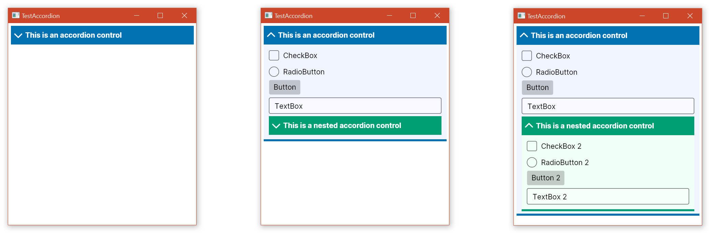

# AvaloniaAccordion: an accordion-like expandable control for Avalonia


**AvaloniaAccordion** is an "accordion" control for Avalonia. This control is similar to an `Expander`, in the sense that it can be in an "open" state, in which its contents are shown, or in a "closed" state, in which the contents are hidden and only the header is shown.

The library contains a control, defined in the `AvaloniaAccordion.Accordion` class. It is released under the [GPLv3](https://www.gnu.org/licenses/gpl-3.0.html) licence.



## Getting started

The library targets .NET Standard 2.0, thus it can be used in projects that target .NET Standard 2.0+ and .NET Core 2.0+.

To use the library in your project, you should install the [AvaloniaAccordion Nuget package](https://www.nuget.org/packages/AvaloniaAccordion/).

This repository also contains a very simple demo project using the control.

## Usage

You will need to add the relevant `using` directive (in C# code) or the XML namespace (in the XAML code). You can then add the control from the AvaloniaAccordion namespace. For example

```XAML
<Window ...
        xmlns:acc="clr-namespace:AvaloniaAccordion;assembly=AvaloniaAccordion">
  ...
    <acc:Accordion IsOpen="True" ArrowSize="18" ArrowPosition="Left">
  ...
</Window>
```

Look at the source code in the [MainWindow.xaml](https://github.com/arklumpus/AvaloniaAccordion/blob/main/TestAccordion/MainWindow.axaml) file to see more examples.

### `Accordion` control

The main properties of the `Accordion` control are:

* The `IsOpen` property, which (unsurprisingly) is `true` when the accordion is open and `false` when it is closed. This can be manually set to open/close the accordion from code.

* The `TransitionDuration` property, which determines the duration of the animations that plays when the accordion is open. Set to `0` to have the accordion open/close instantly.

* The `AccordionContent` property, which is used to specify the content of the accordion. Set this to an avalonia control (e.g. a `StackPanel` or a `Grid`).

* The `AccordionHeader` property, which specifies the header of the accordion. Set this to an avalonia control (e.g. a `StackPanel` or a `Grid`).

* `HeaderForegeround` specifies the colour of the arrows in the header.

* `HeaderBackground` specifies the background brush of the header (at rest).

* `HeaderHoverBackground` specifies the background brush of the header (when the mouse is hovering it).

* `HeaderPressedBackground` specifies the background colour of the header (when the user is clicking on it).

* `ContentBackground` determines the background colour of the part of the accordion that contains the `AccordionContent`.

* `BottomBarBrush` specifies the brush used for the bar at the bottom of the accordion.

* `BottomBarThickness` specifies the thickness of the bar at the bottom of the accordion. Set to `0` to hide the bar.

* The `ArrowSize` property determines the size of the arrows in the header.

* The `ArrowPosition` property determines the positon of the arrows in the header (i.e. to the left, to the right, neither or both).

The control also has a public `InvalidateHeight` method; this method should be called every time that the height of the content of the accordion changes, so that the accordion is notified of this and can update its height to match the content. If you are using nested `Accordion`s, each one will automatically notify its first `Accordion` ancestor; otherwise, if you are using other kinds of controls that can change size, you need to manually invoke the methow whenever the height changes.

## Source code

The source code for the library is available in this repository. The repository contains code for the `AvaloniaAccordion` library project and the demo application.